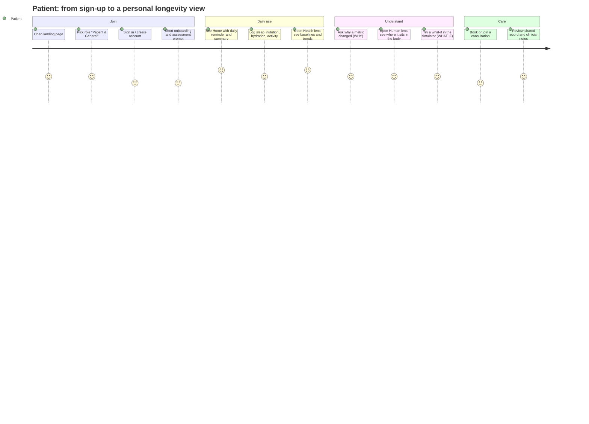
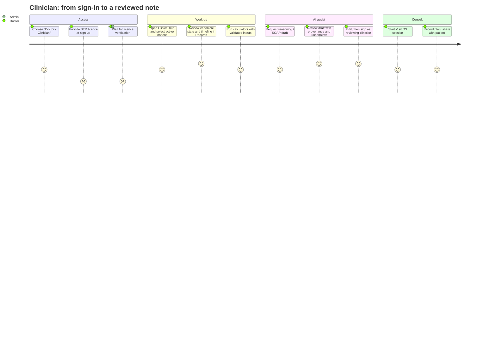
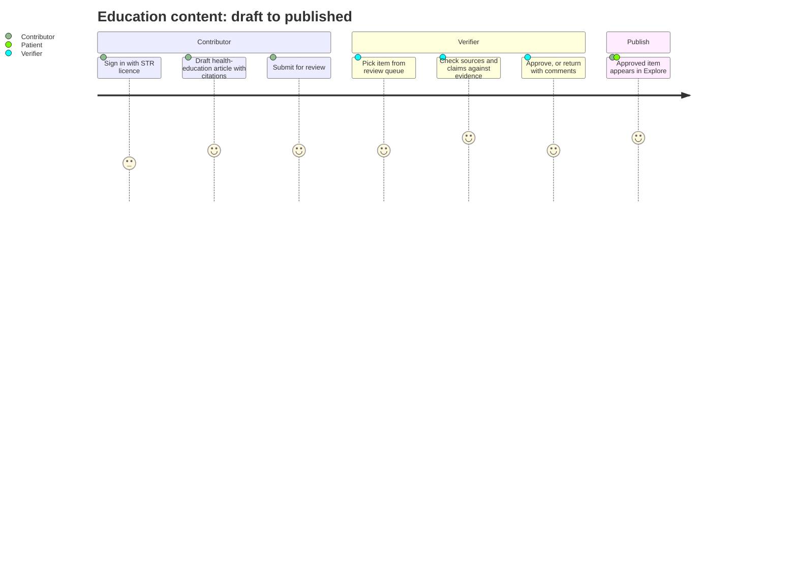
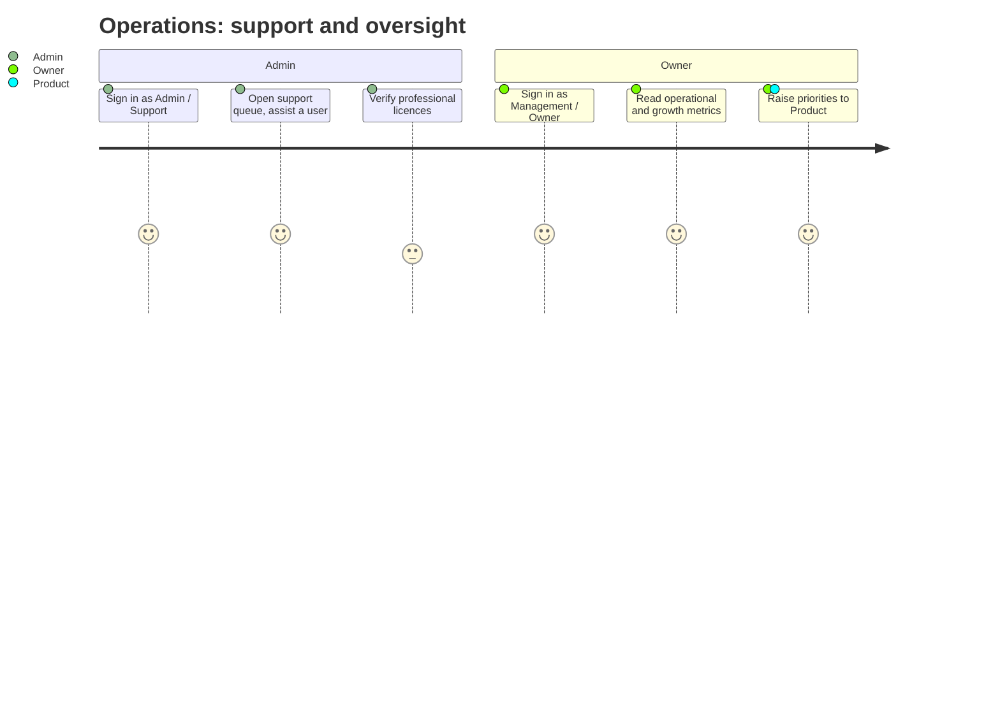
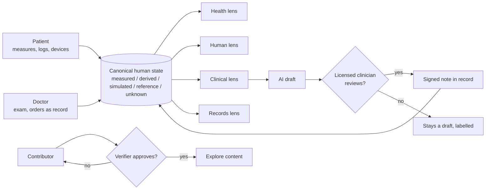

# Panaceamed — Product Requirements Document (PRD)

| | |
|---|---|
| Status | Draft v0.1 for UI/UX and Engineering review |
| Audience | UI/UX + Frontend, Platform & Backend, Core Product, Clinical/Scientific advisors |
| Source of truth | Repository (`src/lib/superPages.ts`, `src/pages/landing/loginData.ts`, `governance/FEATURE_REGISTRY.yaml`). Where this PRD infers something not in the repo it is marked **[Assumption]**. |
| Language | UI strings are written in English first, then translated (`src/locales`). |

> **Safety boundary (applies to every feature below).** Panaceamed does not diagnose, prescribe, dose, or make autonomous emergency decisions. AI output is a draft until a identified licensed clinician reviews it. Measured, derived, simulated and reference data stay visibly distinct, and unknown data is shown as "unknown", never guessed. See `CLAUDE.md` §8.

---

## 1. Product summary

Panaceamed is a longitudinal health platform built around **one canonical human model per person**. The AI-EMR, clinical tools, body explorer (3D anatomy and physiology), sport/performance, and Visit OS all read and write the same state; they are lenses on it, not separate apps.

**Primary product center:** personalised, longitudinal longevity and wellness (labs, personal baselines, biological-age trajectory, sleep/recovery, fitness, environment) for the public, with clinician-grade tools on the same data for licensed professionals.

### Goals
1. A person can see and understand their own health state over time in two taps from Home.
2. A clinician can work from the same record with reviewed, provenance-labelled AI assistance.
3. Educational and simulation content is evidence-backed and never presented as patient-specific truth.

### Non-goals
- Autonomous diagnosis, dosing, prescribing, ordering, or emergency decisions.
- Treating an atlas/teaching model as the patient's anatomy.
- Feature count as a success metric.

---

## 2. Team and ownership

| Person | Role | Owns in this PRD |
|---|---|---|
| **Rizky** | Founder & Medical Product Owner | Vision, priorities, clinical product decisions, final sign-off |
| **Gafi Irfandi** | Core Product | Scope, requirements, roadmap, cross-role consistency |
| **Vika** | UI/UX & Frontend | Journeys, information architecture, screens, frontend implementation |
| **Insan Kamil** | Platform & Backend Engineering Lead | APIs, data model, auth/roles, realtime, infrastructure |
| **Prof. Mega** | Clinical, Scientific & Health Data Advisor | Clinical review, evidence/provenance rules, reference ranges, validation |

---

## 3. User roles

Six account roles exist in the product today (`Role` in `src/lib/types.ts`). Doctor, contributor and verifier require a professional licence (STR) at sign-up.

| Role (code) | Who | Segment | Licence | Main goal |
|---|---|---|---|---|
| **Patient / General** (`pasien`) | Individual user | B2C | No | Understand and improve own health, longevity, nutrition, sleep, fitness |
| **Doctor / Clinician** (`dokter`) | Licensed clinician | B2B (clinics, hospitals); also solo practitioners **[Assumption]** | STR | Work patients up with AI-EMR and reviewed AI drafts, run consultations |
| **Medical Contributor** (`kontributor`) | Clinician/writer | B2B/B2B2C content | STR | Write and curate health-education material |
| **Journal Verifier** (`verifikator`) | Reviewer | B2B/B2B2C content | STR | Review literature, validate evidence before publication |
| **Admin / Support** (`admin`) | Operations staff | Internal | n/a | Run platform operations, assist users |
| **Owner / Management** (`owner`) | Business owner | Internal | n/a | Monitor operational and growth metrics |

**Target markets.** B2C = Patient/General. B2B = clinicians and facilities using AI-EMR, planning and consultation. Content network = Contributor + Verifier. Internal = Admin, Owner.

**Differences that drive design.**

| Dimension | Patient (B2C) | Clinician (B2B) | Contributor / Verifier | Admin / Owner |
|---|---|---|---|---|
| Entry point | Home → Health / Human | Clinical hub → patient | Editorial queue | Ops dashboards |
| Data scope | Own data only | Active patient, with access lineage; only doctors switch patients | Content, not patient data | Aggregates/ops, not clinical content |
| AI role | Education & lifestyle guidance, labelled | Drafts for review (SOAP, reasoning) | Drafting aid, human-reviewed | n/a |
| Tone/density | Visual first, one sentence per item, detail behind disclosure | Dense, structured, provenance visible | Editorial | Tabular |
| Key risk | Misreading advice as diagnosis | Over-trusting an unreviewed draft | Unsupported claims | Over-broad access |

---

## 4. Information architecture

Seven category pages are lenses on the same canonical human state; feature routes live beneath them and stay searchable (`src/lib/superPages.ts`).

| Category | Cue | Purpose |
|---|---|---|
| **Human** | Anatomy · physiology · imaging | Body explorer, 3D anatomy, body exposure |
| **Health** | Prevention · performance · recovery | Longevity, nutrition, sleep, fitness, calculators |
| **Clinical** | Care · reasoning · treatment | AI-EMR, clinical planning, consultation |
| **Explore** | Knowledge · evidence · education | Study, literature, learning |
| **Simulate** | What-if · procedures · models | Health simulator, procedure and physiology models |
| **Records** | Timeline · devices · medical record | Longitudinal record, devices, logs |
| **For You** | Life · people · account | Community, account, settings |

Interaction grammar for every surface: **SEE → ASK → ZOOM → WHY → WHAT IF → ACT**. Primary navigation should reach any important feature in at most two taps from Home.

---

## 5. Features by area (what exists / maturity)

Maturity is taken from `governance/FEATURE_REGISTRY.yaml` and is *technical*, not clinical validation. "Reviewed" and "validated" clinically are separate states and none is claimed here.

| ID | Feature | Category | Registry maturity |
|---|---|---|---|
| F1 | Canonical longitudinal patient state | all (shared) | Unknown (to be audited) |
| F2 | Clinical Intelligence & AI-EMR | Clinical, Records | Functional |
| F3 | Longitudinal Health & Longevity | Health | Functional |
| F4 | Unified Body Exposure (3D anatomy, physiology, scales body → genome) | Human, Simulate | Unknown (to be audited) |
| F5 | Physiological State Engine (provenance-aware) | Human, Simulate | Functional |
| F6 | Embodied Workflow Observation | Clinical, Explore | Functional |
| F7 | Clinical calculators (scores, dosing-adjacent tools with input validation) | Health, Clinical | In progress (validation hardening) |
| F8 | Nutrition, hydration, sleep, fitness tools | Health | **[Assumption]** functional |
| F9 | Visit OS (consultation, realtime) | Clinical | **[Assumption]** functional |
| F10 | Education, study, journal verification | Explore | **[Assumption]** functional |
| F11 | Pharmacy facilities | For You / Health | **[Assumption]** |
| F12 | Community, account, settings, onboarding | For You | Functional |

> Prof. Mega / Gafi: rows marked **[Assumption]** need a registry entry and an audited maturity before engineering commits scope.

---

## 6. Features per role

Legend: ● primary · ○ available · — not available.

| Feature | Patient | Doctor | Contributor | Verifier | Admin | Owner |
|---|---|---|---|---|---|---|
| Home / dashboard (daily reminder, summary) | ● | ○ | ○ | ○ | ○ | ○ |
| Canonical state view (own) | ● | ● (active patient) | — | — | — | — |
| Body Explorer / Body Exposure (atlas, reference) | ● | ● | ○ | ○ | — | — |
| Longevity, biological-age trend, baselines | ● | ○ | — | — | — | — |
| Nutrition, hydration, sleep, fitness | ● | ○ | — | — | — | — |
| Health simulator (what-if) | ● | ● | ○ | ○ | — | — |
| Clinical calculators | ○ | ● | — | — | — | — |
| AI-EMR / clinical reasoning drafts | — (own records read-only **[Assumption]**) | ● | — | — | — | — |
| Clinical planning, SOAP drafts | — | ● | — | — | — | — |
| Consultation / Visit OS | ● | ● | — | — | ○ (support) | — |
| Records timeline, devices, logs | ● | ● | — | — | — | — |
| Study & learning content | ● | ○ | ● | ● | — | — |
| Author/curate health content | — | ○ | ● | ○ | — | — |
| Literature review & evidence validation | — | — | ○ | ● | — | — |
| Pharmacy facilities | ● | — | — | — | — | — |
| User/ops management, support tooling | — | — | — | — | ● | ○ |
| Growth & operational metrics | — | — | — | — | ○ | ● |

Cross-cutting requirements for all roles: consent and purpose-bound access, audit trail, mobile 390×844, accessibility basics, English-first strings.

---

## 7. User journeys

Diagrams are Mermaid and render on GitHub. Each shows the happy path, with safety/review gates marked.

### 7.1 Patient / General (B2C)

### 7.2 Doctor / Clinician (B2B)

### 7.3 Contributor → Verifier (content network)

### 7.4 Admin / Support and Owner

### 7.5 Cross-role system flow

---

## 8. Requirements and acceptance

### 8.1 Functional
| # | Requirement | Owner |
|---|---|---|
| R1 | Role chosen at sign-up determines navigation and data scope; STR roles require a licence step | Insan Kamil (enforce), Vika (UI) |
| R2 | Patients see only their own data; only doctors can switch active patient | Insan Kamil |
| R3 | Every AI output shows draft status, provenance and uncertainty until clinician review | Vika, Prof. Mega |
| R4 | Numeric inputs: empty ≠ 0, out-of-range rejected with a named reason, never a guessed value | Engineering |
| R5 | Any primary feature reachable in ≤ 2 taps from Home | Vika, Gafi |
| R6 | Category switch changes lens only, never the represented human state | Vika |

### 8.2 Non-functional
- **Mobile first:** correct at 390×844, no horizontal scroll, tap targets ≥ 24 px minimum (larger preferred).
- **Performance:** heavy 3D is lazy-loaded; WebGL fallback exists.
- **Privacy/security:** consent, audit, limited retention, no PHI in logs.
- **Quality gate:** every logic change ships positive, negative and boundary tests; CI must be green at the exact head before merge.

### 8.3 Success metrics **[Assumption — to be agreed]**
- Time to first meaningful health view for a new patient.
- Share of clinician AI drafts reviewed (signed or edited) before use.
- Content items verified before publication (target 100%).
- Weekly active patients logging at least one metric.

---

## 9. Risks and open questions

| # | Item | Owner |
|---|---|---|
| Q1 | Final B2B/B2C packaging and pricing; which roles are paid | Rizky, Gafi |
| Q2 | Can patients read AI-generated clinician notes, and when | Prof. Mega, Rizky |
| Q3 | Licence (STR) verification process and who performs it | Rizky, Insan Kamil |
| Q4 | Audited maturity for rows marked **[Assumption]** in §5 | Gafi, Insan Kamil |
| Q5 | Clinical review status of reference ranges and calculators | Prof. Mega |
| Q6 | Anonymous community interactions policy (likes) | Rizky |

## 10. Deliverables still to produce
- **Figma:** features-by-role map and the journeys above as a Figma/FigJam diagram (Vika). The Figma connector is not available in the authoring session; the Mermaid diagrams here are the importable source.
- Per-role screen inventory and low-fidelity flows (Vika).
- API/permission matrix derived from §6 (Insan Kamil).
