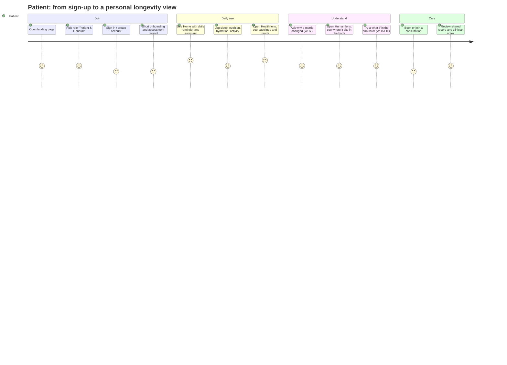
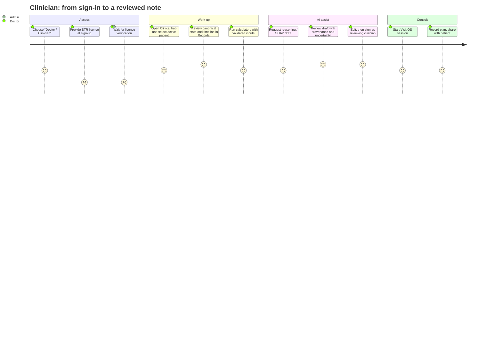
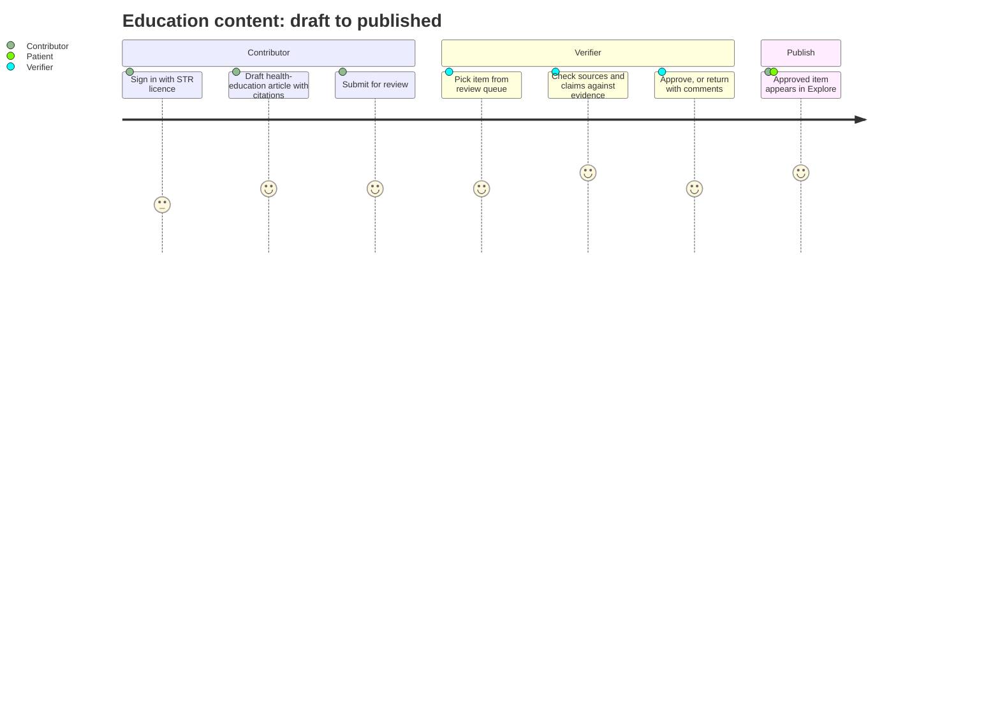
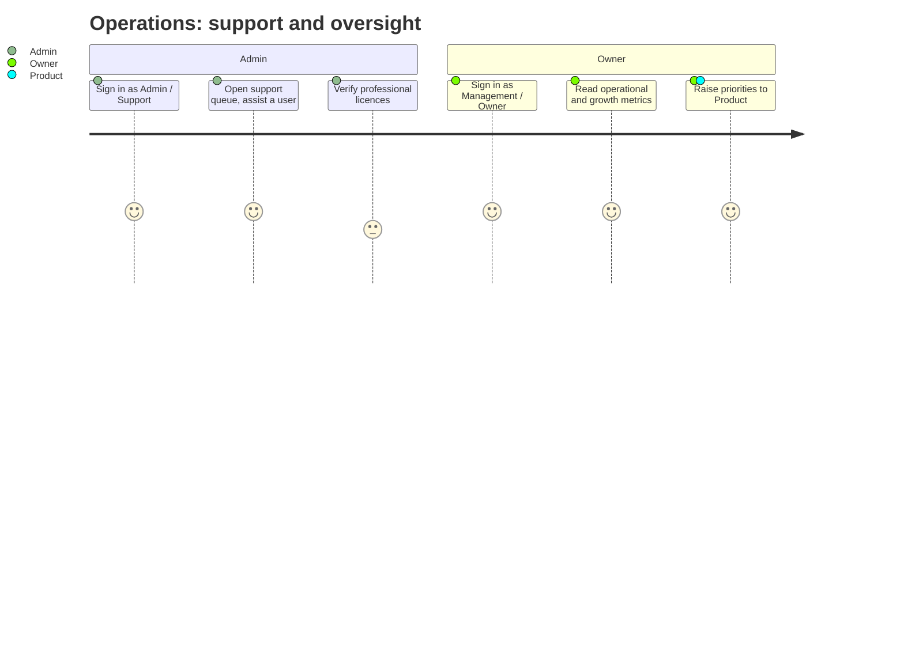
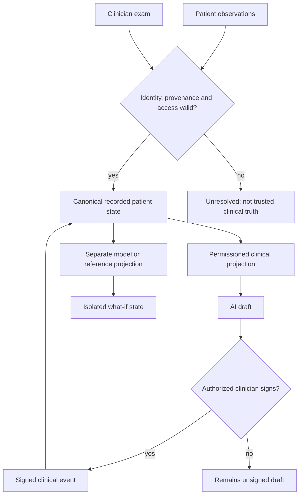
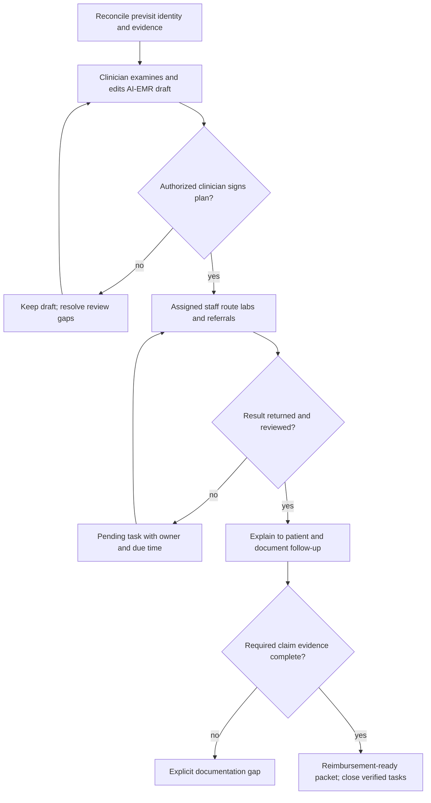
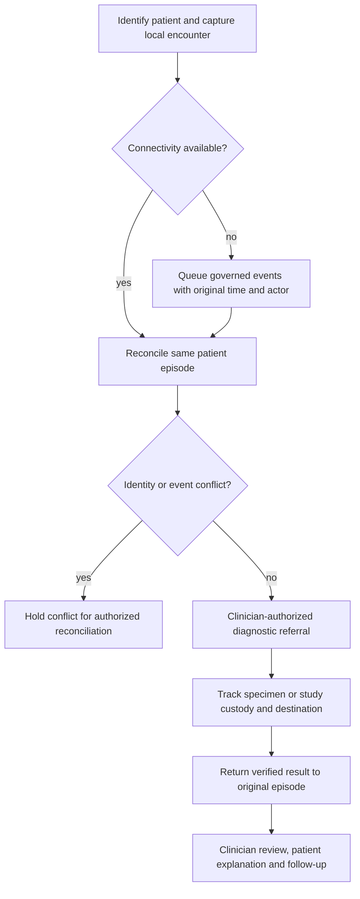
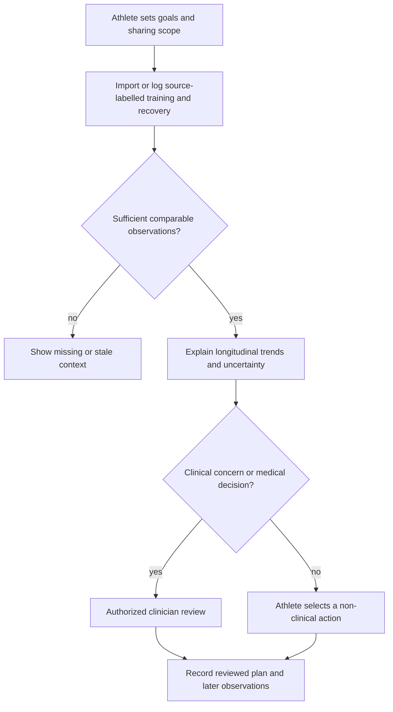
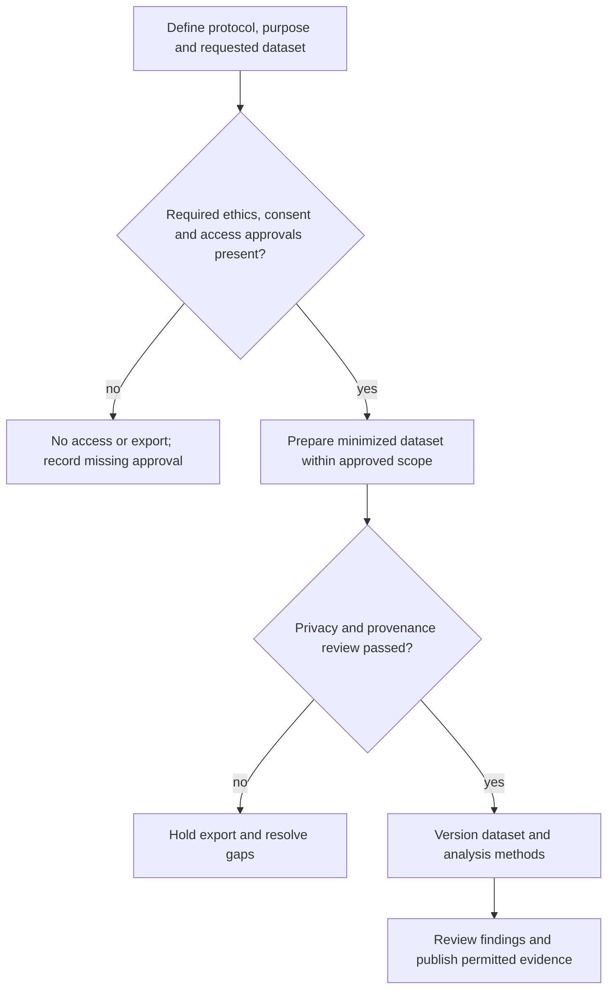
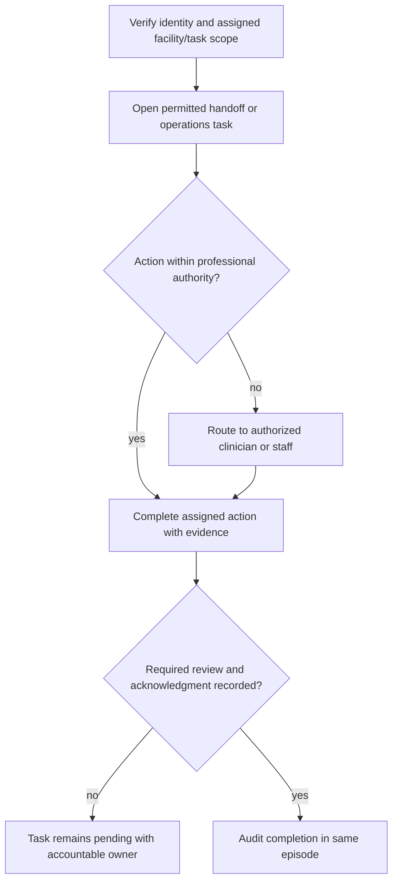

# Panaceamed — Product Requirements Document (PRD)

| | |
|---|---|
| Status | Draft v0.2 for UI/UX and Engineering review; requirements are not implementation evidence |
| Audience | UI/UX + Frontend, Platform & Backend, Core Product, Clinical/Scientific advisors |
| Source of truth | Repository (`src/lib/superPages.ts`, `src/pages/landing/loginData.ts`, `governance/FEATURE_REGISTRY.yaml`). Where this PRD infers something not in the repo it is marked **[Assumption]**. |
| Language | UI strings are written in English first, then translated (`src/locales`). |

> **Safety boundary (applies to every feature below).** Panaceamed does not autonomously diagnose, prescribe, dose, order, or make emergency decisions. Clinical AI output remains a draft until an identified, authorized licensed clinician reviews and signs the consequential clinical action. Educational AI content remains labelled and follows its applicable content-review policy; it is not a signed patient-care decision. Measured, derived, simulated and reference data stay visibly distinct, and unknown data is shown as "unknown", never guessed. See [CLAUDE.md §8](../../CLAUDE.md).

---

## 1. Product summary

Panaceamed is **PANACEA ONE OS**, a unified longitudinal healthcare orchestration platform built around **one canonical patient identity and governed recorded state per person**. AI-EMR, clinical tools, body explorer, sport/performance, and Visit OS are permissioned projections over that context. Model-derived physiology, reference anatomy and isolated what-if simulations remain distinct truth classes; no projection may silently write a simulation or AI estimate into measured or signed clinical truth.

**Primary product center:** personalised, longitudinal longevity and wellness (labs, personal baselines, biological-age trajectory, sleep/recovery, fitness, environment) for the public, with clinician-grade tools on the same data for licensed professionals.

**Current delivery wedge:** the [Longitudinal Clinical Encounter Orchestrator](../../PANACEA_CURRENT_WEDGE.md): previsit reconciliation → clinician-controlled examination and AI-EMR draft → signed plan → labs/referrals and results closure → patient education → reimbursement-ready documentation → follow-up. This proves the broader One OS vision one workflow at a time. Outcome delivery means verified, controllable workflow completion, not promised cure or unrestricted autonomous medicine.

### Goals
1. A person can see and understand their own health state over time in two taps from Home.
2. A clinician can work from the same record with reviewed, provenance-labelled AI assistance.
3. Educational and simulation content is evidence-backed and never presented as patient-specific truth.

### Non-goals
- Autonomous diagnosis, dosing, prescribing, ordering, or emergency decisions.
- Treating an atlas/teaching model as the patient's anatomy.
- Feature count as a success metric.

---

## 2. Team and ownership

| Person | Role | Owns in this PRD |
|---|---|---|
| **Rizky** | Founder & Medical Product Owner | Vision, priorities, clinical product decisions, final sign-off |
| **Gafi Irfandi** | Core Product | Scope, requirements, roadmap, cross-role consistency |
| **Vika** | UI/UX & Frontend | Journeys, information architecture, screens, frontend implementation |
| **Insan Kamil** | Platform & Backend Engineering Lead | APIs, data model, auth/roles, realtime, infrastructure |
| **Prof. Mega** | Clinical, Scientific & Health Data Advisor | Clinical review, evidence/provenance rules, reference ranges, validation |

---

## 3. User roles

Six account roles exist in the product today (`Role` in `src/lib/types.ts`). Doctor, contributor and verifier require a professional licence (STR) at sign-up.

| Role (code) | Who | Segment | Licence | Main goal |
|---|---|---|---|---|
| **Patient / General** (`pasien`) | Individual user | B2C | No | Understand and improve own health, longevity, nutrition, sleep, fitness |
| **Doctor / Clinician** (`dokter`) | Licensed clinician | B2B (clinics, hospitals); also solo practitioners **[Assumption]** | STR | Work patients up with AI-EMR and reviewed AI drafts, run consultations |
| **Medical Contributor** (`kontributor`) | Clinician/writer | B2B/B2B2C content | STR | Write and curate health-education material |
| **Journal Verifier** (`verifikator`) | Reviewer | B2B/B2B2C content | STR | Review literature, validate evidence before publication |
| **Admin / Support** (`admin`) | Operations staff | Internal | n/a | Run platform operations, assist users |
| **Owner / Management** (`owner`) | Business owner | Internal | n/a | Monitor operational and growth metrics |

**Target markets.** B2C = Patient/General. B2B = clinicians and facilities using AI-EMR, planning and consultation. Content network = Contributor + Verifier. Internal = Admin, Owner.

### 3.1 Target personas are not account privileges

Hospitals, Puskesmas, athletes and researchers are workflow/buyer personas, not additional values of `Role`. The following requirements extend the existing role map; they do not claim that institutional tenancy, research exports or payer integrations are implemented. Staff scope and new capabilities require explicit policy and validation before release. Signup role selection or a supplied STR is not proof of verified licensure or patient-access authorization.

| Persona / market | Buyer and user | Existing role relationship | Distinct workflow requirement |
|---|---|---|---|
| General public / patient (B2C) | Individual; caregiver only with delegated scope | `pasien` | Own longitudinal record, understandable education, consent and follow-up |
| Doctor / solo practice (B2B or professional B2C) | Clinician or practice | `dokter` with verified licence and authorized patient scope | Reconcile evidence, review drafts, sign decisions and close the episode |
| Hospital / clinic (B2B) | Facility; clinical and operations staff | `dokter` for care; `admin`/`owner` are platform roles, not automatic facility privileges | Tenant-scoped worklists, handoffs, result closure and evidence-backed reimbursement |
| Puskesmas / primary care (B2B) | Facility/network; clinician and authorized staff | Scoped professional access; no new account role implied | Offline capture, remote diagnostic referral, identity/custody continuity and later reconciliation |
| Athlete / performance user (B2C; team B2B when consented) | Individual or team; athlete and permissioned coach | `pasien` for own state; coach privileges require a separate reviewed policy | Training/recovery context, source-labelled estimates and scoped sharing without automatic medical clearance |
| Researcher (institutional B2B) | Research institution; approved investigator | Contributor/verifier covers editorial work only, not research-data entitlement | Approved purpose, consent/legal basis, minimized datasets, reproducible provenance and controlled exports |
| Healthcare professional / institutional administrator (B2B) | Facility; allied-health or operations staff | No implicit doctor privilege from occupation or platform-admin role | Task-scoped handoffs and operational access; clinical signing only within verified legal/professional authority |

Institutional permissions and commercial packaging remain **proposed requirements** pending owner, clinical and security review. Existing account roles must not be repurposed to grant unimplemented privileges.

**Differences that drive design.**

| Dimension | Patient (B2C) | Clinician (B2B) | Contributor / Verifier | Admin / Owner |
|---|---|---|---|---|
| Entry point | Home → Health / Human | Clinical hub → patient | Editorial queue | Ops dashboards |
| Data scope | Own data only | Active patient, with access lineage; only doctors switch patients | Content, not patient data | Aggregates/ops, not clinical content |
| AI role | Education & lifestyle guidance, labelled | Drafts for review (SOAP, reasoning) | Drafting aid, human-reviewed | n/a |
| Tone/density | Visual first, one sentence per item, detail behind disclosure | Dense, structured, provenance visible | Editorial | Tabular |
| Key risk | Misreading advice as diagnosis | Over-trusting an unreviewed draft | Unsupported claims | Over-broad access |

---

## 4. Information architecture

Seven category pages are lenses on the same canonical human state; feature routes live beneath them and stay searchable (`src/lib/superPages.ts`).

| Category | Cue | Purpose |
|---|---|---|
| **Human** | Anatomy · physiology · imaging | Body explorer, 3D anatomy, body exposure |
| **Health** | Prevention · performance · recovery | Longevity, nutrition, sleep, fitness, calculators |
| **Clinical** | Care · reasoning · treatment | AI-EMR, clinical planning, consultation |
| **Explore** | Knowledge · evidence · education | Study, literature, learning |
| **Simulate** | What-if · procedures · models | Health simulator, procedure and physiology models |
| **Records** | Timeline · devices · medical record | Longitudinal record, devices, logs |
| **For You** | Life · people · account | Community, account, settings |

Interaction grammar for every surface: **SEE → ASK → ZOOM → WHY → WHAT IF → ACT**. Primary navigation should reach any important feature in at most two taps from Home.

---

## 5. Features by area (what exists / maturity)

Maturity is taken from `governance/FEATURE_REGISTRY.yaml` and is *technical*, not clinical validation. "Reviewed" and "validated" clinically are separate states and none is claimed here.

| ID | Feature | Category | Registry maturity |
|---|---|---|---|
| F1 | Canonical longitudinal patient state | all (shared) | Unknown (to be audited) |
| F2 | Clinical Intelligence & AI-EMR | Clinical, Records | Functional |
| F3 | Longitudinal Health & Longevity | Health | Functional |
| F4 | Unified Body Exposure (3D anatomy, physiology, scales body → genome) | Human, Simulate | Unknown (to be audited) |
| F5 | Physiological State Engine (provenance-aware) | Human, Simulate | Functional |
| F6 | Embodied Workflow Observation | Clinical, Explore | Functional |
| F7 | Clinical calculators (scores, dosing-adjacent tools with input validation) | Health, Clinical | In progress (validation hardening) |
| F8 | Nutrition, hydration, sleep, fitness tools | Health | **[Assumption]** functional |
| F9 | Visit OS (consultation, realtime) | Clinical | **[Assumption]** functional |
| F10 | Education, study, journal verification | Explore | **[Assumption]** functional |
| F11 | Pharmacy facilities | For You / Health | **[Assumption]** |
| F12 | Community, account, settings, onboarding | For You | Functional |

> Prof. Mega / Gafi: rows marked **[Assumption]** need a registry entry and an audited maturity before engineering commits scope.

---

## 6. Features per role

Legend: ● primary · ○ available · — not available.

| Feature | Patient | Doctor | Contributor | Verifier | Admin | Owner |
|---|---|---|---|---|---|---|
| Home / dashboard (daily reminder, summary) | ● | ○ | ○ | ○ | ○ | ○ |
| Canonical state view (own) | ● | ● (active patient) | — | — | — | — |
| Body Explorer / Body Exposure (atlas, reference) | ● | ● | ○ | ○ | — | — |
| Longevity, biological-age trend, baselines | ● | ○ | — | — | — | — |
| Nutrition, hydration, sleep, fitness | ● | ○ | — | — | — | — |
| Health simulator (what-if) | ● | ● | ○ | ○ | — | — |
| Clinical calculators | ○ | ● | — | — | — | — |
| AI-EMR / clinical reasoning drafts | — (own records read-only **[Assumption]**) | ● | — | — | — | — |
| Clinical planning, SOAP drafts | — | ● | — | — | — | — |
| Consultation / Visit OS | ● | ● | — | — | ○ (support) | — |
| Records timeline, devices, logs | ● | ● | — | — | — | — |
| Study & learning content | ● | ○ | ● | ● | — | — |
| Author/curate health content | — | ○ | ● | ○ | — | — |
| Literature review & evidence validation | — | — | ○ | ● | — | — |
| Pharmacy facilities | ● | — | — | — | — | — |
| User/ops management, support tooling | — | — | — | — | ● | ○ |
| Growth & operational metrics | — | — | — | — | ○ | ● |

Cross-cutting requirements for all roles: consent and purpose-bound access, audit trail, mobile 390×844, accessibility basics, English-first strings.

### 6.1 Feature ownership and access boundaries by market

The symbols in §6 describe product emphasis, not an authorization allow-list. Access must be enforced at the service boundary, with positive and negative fixtures for each policy.

| Capability | B2C ownership | B2B responsibility | Boundary / evidence required |
|---|---|---|---|
| Longitudinal record and consent | Patient controls permitted collection/sharing | Authorized care team reconciles scoped observations | Same patient identity; source, time, units, consent and audit lineage |
| AI-EMR and care plan | Patient receives appropriately shared signed explanation | Licensed clinician reviews/edits and signs | Unreviewed draft cannot become an order, prescription or signed record |
| Labs, referrals and follow-up | Patient sees pending actions and returned explanations | Named staff own routing; clinician reviews results | Result received ≠ reviewed ≠ explained ≠ follow-up closed |
| Hospital/clinic operations and reimbursement | Patient can understand coverage/task status | Facility staff assemble evidence; payer adapter owns external exchange | No invented services/signatures; missing adapter remains unsupported |
| Puskesmas offline workflow | Patient remains identifiable across referral | Facility captures custody and reconciles delayed events | Preserve original capture time; conflicts block silent overwrite |
| Athlete performance | Athlete owns goals and observation sharing | Coach/team access only within separately approved scope | Device estimate ≠ lab measurement; no automatic return-to-play decision |
| Research and evidence | Participation and permitted use are transparent | Investigator uses approved, minimized scope | No raw patient access or export from contributor/verifier/admin label alone |
| Body Exposure | Patient/learner sees reference education | Clinician/educator interprets evidence-labelled models | Atlas ≠ patient anatomy; simulation cannot overwrite the clinical timeline |
| Institutional support | User requests a scoped support action | Staff complete assigned operational work | Owner/admin access cannot bypass tenant, consent or clinical-signature controls |

Target authorization contract: `Allowed = IdentityVerified ∧ RolePermitted ∧ PatientOrTenantScope ∧ PurposePermitted ∧ ApplicableConsent ∧ ActionAuthority`. All applicable terms must pass; failure denies the action and records an appropriate audit event. This is a requirement, not a claim that one current function implements every term.

---

## 7. User journeys

Diagrams are Mermaid and render on GitHub. Each shows the happy path, with safety/review gates marked.

### 7.1 Patient / General (B2C)

### 7.2 Doctor / Clinician (B2B)

### 7.3 Contributor → Verifier (content network)

### 7.4 Admin / Support and Owner

### 7.5 Cross-role system flow

---

### 7.6 Hospital / clinic episode (B2B)

Target journey, not evidence of a live hospital/payer integration. The patient and doctor journeys in §7.1–7.2 continue through this same episode after the encounter.

Clinical review, patient explanation, follow-up closure and claim preparation have separate recorded states. A ready packet is not payer acceptance or settled payment. No task closes merely because a note or notification was generated.

### 7.7 Puskesmas / primary care with intermittent connectivity (B2B)

No unsupported offline, laboratory or payer adapter is presented as connected. Delayed arrival preserves original capture time; missing custody or identity prevents a trusted completion claim.

### 7.8 Athlete / performance user (B2C; permissioned team B2B)

Device-derived readiness and VO₂max remain estimates when applicable. Neither a coach role nor a performance score authorizes prescribing, medical clearance or return-to-play decisions.

### 7.9 Researcher / institution (B2B)

De-identification is a reviewed process, not a guarantee of anonymity. Revocation, retention, export and research use follow the approved protocol and applicable policy; there is no automatic research entitlement from an editorial role.

### 7.10 Healthcare professional / institutional administrator (B2B)

Platform support, facility administration, allied-health work and clinical signing are distinct authorities. Financial or operational access does not grant chart-wide access or permission to sign clinical decisions.

## 8. Requirements and acceptance

### 8.1 Functional
| # | Requirement | Owner |
|---|---|---|
| R1 | Role chosen at sign-up determines navigation and data scope; STR roles require a licence step | Insan Kamil (enforce), Vika (UI) |
| R2 | Patients see only their own data; only doctors can switch active patient | Insan Kamil |
| R3 | Clinical AI output shows draft status, provenance and uncertainty until authorized clinician review/sign-off; educational output remains labelled with provenance/uncertainty and follows applicable content review | Vika, Prof. Mega |
| R4 | Numeric inputs: empty ≠ 0, out-of-range rejected with a named reason, never a guessed value | Engineering |
| R5 | Any primary feature reachable in ≤ 2 taps from Home | Vika, Gafi |
| R6 | Category switch changes lens only, never the represented human state | Vika |
| R7 | Every episode task has an accountable actor, status, due time where applicable and completion evidence; received, reviewed, explained and closed are distinct | Product + Platform |
| R8 | Reference/model/what-if state stays isolated from recorded patient truth and consequential clinical actions | Engineering + Clinical advisor |
| R9 | Institutional, research and delegated access requires explicit scoped policy; signup role alone grants no new authority | Platform + Clinical/security reviewers |

### 8.2 Non-functional
- **Mobile first:** correct at 390×844, no horizontal scroll, tap targets ≥ 24 px minimum (larger preferred).
- **Performance:** heavy 3D is lazy-loaded; WebGL fallback exists.
- **Privacy/security:** consent, audit, limited retention, no PHI in logs.
- **Quality gate:** every logic change ships positive, negative and boundary tests; CI must be green at the exact head before merge.

### 8.3 Success metrics **[Assumption — to be agreed]**
- Time to first meaningful health view for a new patient.
- Share of consequential clinical AI drafts reviewed and signed by an authorized clinician before use; editing alone is not sign-off.
- Content items verified before publication (target 100%).
- Weekly active patients logging at least one metric.

### 8.4 Acceptance per persona — target validation, not completed tests

Every criterion below needs linked evidence at the evaluated revision before it can be labelled accepted. Use synthetic/authorized fixtures; never publish patient data in CI or this public repository. UI visibility is not evidence of service authorization. Product owns task definitions; Platform owns access/state enforcement; UI/UX owns comprehension/accessibility; qualified clinical and research/privacy reviewers own applicable release review.

| Persona | Positive acceptance | Negative / boundary acceptance | Minimum evidence |
|---|---|---|---|
| Patient / general public | Own record retains identity across Health, Human and Clinical; shared signed explanation and next follow-up action are understandable | Another patient's data denied; revoked sharing denied; missing observations shown as unknown; unsigned clinical draft not presented as approved plan | Scoped service fixtures, mobile/keyboard journey and predefined patient comprehension instrument |
| Doctor / solo practitioner | Verified, authorized clinician reconciles inputs, edits draft and signs a versioned plan; later result review remains in same episode | Unverified licence, wrong patient scope or unsigned decision cannot execute a consequential clinical action; stale/contradictory input remains visible | Authorization/signature fixtures, record lineage and end-to-end result-closure evidence |
| Hospital / clinic | Assigned work moves from signed plan to referral/result, explanation and follow-up; claim packet reuses real signed evidence | Cross-tenant access denied; missing evidence/adapter blocks ready status; result receipt alone cannot close review or follow-up | Tenant fixtures, episode state transitions, adapter fixtures where claimed and operational walkthrough |
| Puskesmas / primary care | Offline capture reconciles to same patient with original timestamps and custody; returned diagnostic result reaches same episode | Duplicate delivery is idempotent; identity conflict or broken custody holds trust/completion; outage never fabricates a returned result | Offline/replay/conflict fixtures and remote referral return-path walkthrough |
| Athlete / performance user | Athlete can trace training/recovery trend to device/lab/user source and control any team sharing | Stale/insufficient data yields unknown context; revoked coach access denied; estimate is not labelled measured or used as automatic medical clearance | Source/consent fixtures, mobile performance journey and labelled-estimate review |
| Researcher | Approved purpose produces a versioned minimized dataset and reproducible method within scope | Missing required ethics/consent/policy review or unapproved export denied; contributor/verifier label alone gives no patient-data entitlement | Protocol-specific access/export/privacy fixtures and recorded research approval |
| Healthcare professional / institutional administrator | Assigned task shows permitted minimum information, actor and completion evidence in same episode | Wrong facility/task scope denied; support/finance privileges cannot sign or overwrite clinical truth; incomplete acknowledgment stays pending | Role/task/service fixtures and handoff audit trail |
| Contributor / verifier; platform admin / owner | Content review/publishing and support/aggregate oversight follow their distinct queues | Unsupported claim cannot bypass publication review; admin/owner status cannot bypass patient scope or clinical signing | Editorial approval and support/aggregate authorization fixtures |

Body Exposure is a cross-persona projection: preserve whole-body-first architecture, source-backed laterality/relations and licensing, progressive loading, WebGL fallback, orbit/zoom/selection, labels, responsive non-obstructive UI and reduced motion. Anatomical coverage, render success and clinical/educational validation are distinct evidence. Follow the [Universal Human Gold Standard](../body-exposure/HUMAN_DIGITAL_TWIN_GOLD_STANDARD.md); geometry, lesion or surgical claims need appropriate validation before release.

### 8.5 Outcome-delivery measurement contract

Targets and pilot acceptance thresholds require predefined tasks, comparable populations and qualified review before measurement. No measured results are claimed by this PRD. Report each dimension separately; missing measurements and zero denominators are **unmeasured**, never converted into 0% or 100%. A speed or commercial gain cannot compensate for failed safety, access or clinical-signature controls.

| Metric | Formula | Measurement boundary |
|---|---|---|
| Workflow time reduction | `(T_baseline − T_OneOS) / T_baseline × 100%` | Same task definition and comparable cases/users; `T_baseline > 0` |
| Trusted completeness | `trusted required data classes present / required data classes` | Required classes predefined; identity, time, normalization, provenance and required review all pass |
| Structural trust coverage | `trustworthy reconciled fragments / evaluated fragments` | Predefine evaluated fragments; patient identity, source, timestamp, provenance, normalization and required review all pass; not proof of biomedical correctness |
| Result follow-up closure | `results with all protocol-required review, explanation and follow-up evidence / results due for closure in the evaluation window` | Predefine window, due rules and valid not-applicable reasons; do not hide overdue results |
| Clinical sign-off coverage | `consequential clinical actions with valid prior authorization/signature / consequential clinical actions evaluated` | Required control target 100%; drafts and simulations do not count as signed actions |
| Patient understanding | `correct responses / scored responses × 100%` | Predefined comprehension instrument; report subgroup results |
| Understanding gain | `U_OneOS − U_baseline` | Percentage points; comparable instrument and population |
| First-pass clean-claim rate | `claims accepted without preventable documentation/coding correction / submitted claims` | Actual payer responses required; packet ready ≠ claim accepted |
| Net buyer value | `measurable benefit + avoided cost + recovered capacity + faster cash realization − implementation cost − operating cost − switching/risk cost` | Common unit/time horizon, avoid double counting; evaluate separately for practice, hospital and Puskesmas |

Metric authorities: [One OS doctrine §§11–12](../../PANACEA_ONE_OS_LONGITUDINAL_CARE_DOCTRINE.md), [worthiness evidence standard §7](../../PANACEA_WORTHINESS_EVIDENCE_STANDARD.md) and [universal human acceptance metrics](../../PANACEA_UNIVERSAL_HUMAN_ACCEPTANCE_STANDARD.md). Result-closure and sign-off metrics above are proposed operational definitions, to be ratified for the evaluated protocol. These metrics prove workflow or structural controls only; they do not by themselves prove clinical correctness, cure, clinical efficacy or external validation.

### 8.6 Source precedence and delivery evidence

The [One OS doctrine](../../PANACEA_ONE_OS_LONGITUDINAL_CARE_DOCTRINE.md), [Computational Human Platform](../../PANACEA_COMPUTATIONAL_HUMAN_PLATFORM.md), [current wedge](../../PANACEA_CURRENT_WEDGE.md), [CLAUDE.md](../../CLAUDE.md) and [Universal Human Gold Standard](../body-exposure/HUMAN_DIGITAL_TWIN_GOLD_STANDARD.md) govern this PRD. The [feature registry](../../governance/FEATURE_REGISTRY.yaml) is an implementation/maturity inventory, not authorization or clinical-validation evidence. Open strategy proposals do not silently supersede accepted doctrine.

Authoritative original: Claude-authored [PR #2285](https://github.com/rizkyazhar486/Panacea/pull/2285), merged as `ae9f58bc8bc8f77731f10cb93df284a40fc6dbb2`. This v0.2 preserves its role matrix and journeys while adding target-market requirements and correcting truth-state ambiguity. A documentation merge delivers requirements only. Runtime implementation, accepted clinical review, production deployment and measured buyer/patient outcomes require separate evidence.

---

## 9. Risks and open questions

| # | Item | Owner |
|---|---|---|
| Q1 | Final B2B/B2C packaging and pricing; which roles are paid | Rizky, Gafi |
| Q2 | Can patients read AI-generated clinician notes, and when | Prof. Mega, Rizky |
| Q3 | Licence (STR) verification process and who performs it | Rizky, Insan Kamil |
| Q4 | Audited maturity for rows marked **[Assumption]** in §5 | Gafi, Insan Kamil |
| Q5 | Clinical review status of reference ranges and calculators | Prof. Mega |
| Q6 | Anonymous community interactions policy (likes) | Rizky |

## 10. Deliverables still to produce
- **Figma:** features-by-role map and the journeys above as a Figma/FigJam diagram (Vika). The Figma connector is not available in the authoring session; the Mermaid diagrams here are the importable source.
- Per-role screen inventory and low-fidelity flows (Vika).
- API/permission matrix derived from §6 (Insan Kamil).
